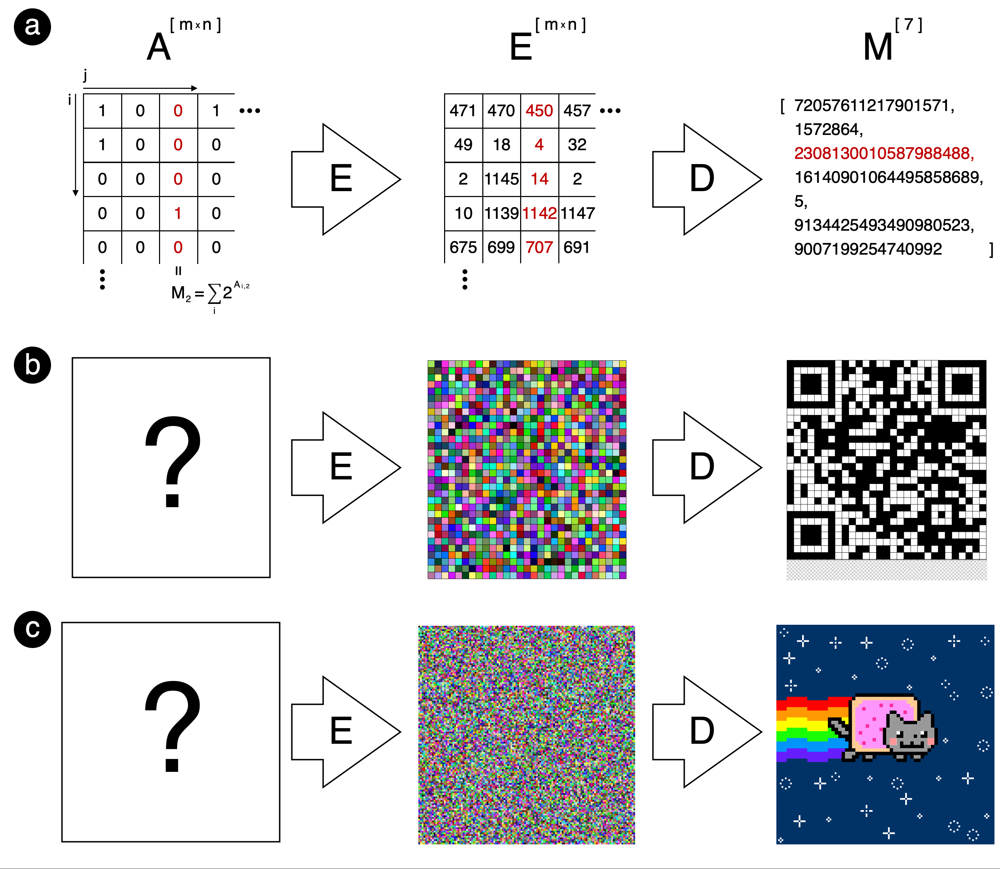

# Summary

The following work presents a *C++* library which is dedicated to performing arbitrary-precise calculations on hypercomplex numbers from the Cayley-Dickson algebras [@schafer2017introduction]. Basic arithmetical operations as well as a few miscellaneous functions are implemented. Its focus is to aid other developers in computational research.

# Statement of need

This is a highly specialised software aimed mostly for computational mathematicians and computational scientists who operate on high-dimensional numbers and/or need to carry out arbitrary-precise calculations. The library is well suited for wide range of computationally-challenging projects: from studying general algebraic properties _per se_ to applied research where hypercomplex framework serves merely as a mean to an end.

# Key features

- As a header-only *C++* template code it's greatest advantage is the combination of speed, generic programming and convenience for the end user. Open Source license together with template specialisation mechanism allows contributors to add-in support for custom objects, define specific functions and extend the scope of the library.
- One of such specialisation is already included in the library itself - a support for arbitrary high precision of calculations via GNU MPFR library [@fousse:inria-00070266], for which the operators have been overloaded such that all the instructions are carried out on specific data structures.
- State of the art technology for software engineering:
  - CI/CD mechanism set up with GitHub Actions: automatic tests for library installation, source code inclusion, compilation and execution,
  - extensive unit testing with Catch2 framework [@catch2] alongside code coverage measurement uploaded to Codecov; current coverage: 100%,
  - source code linting with cpplint [@cpplint] - Google code style enforced,
  - automatic documentation generation and hosting on GitHub Pages: build via Doxygen [@doxygen], publishing via Actions.

# Cryptographic applications

lorem ipsum

# State of the field

The well-known _boost C++_ libraries deserve the most notable mention here [@boost]. Unfortunately their scope is limitted as they only provide quaterions and octonions classes (however as an upside of that specialisation all the operations are well optimised). Moreover, these libraries do not support operations on MPFR types natively. It may also be worth to mention the existence of smaller repositories like: [@quaternions] or [@cd], but, unlike our work, they often lack proper test suites, code coverage reports, documentation and are also significantly restricted in functionality which is a major drawback.

# References

